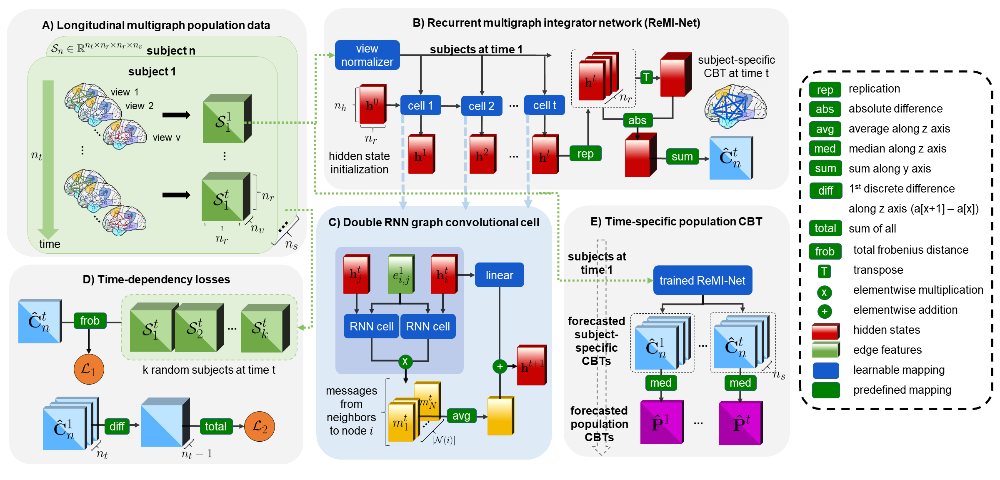

# ReMI-Net
ReMI-Net for jointly predictingconnectional brain templates from a single brain graph, coded up in Python by Oytun Demirbilek. Please contact oytun1996@gmail.Com for further inquiries. Thanks. 

This repository provides the official PyTorch implementation of the following paper:

> **Title**
> [Oytun Demirbilek](https://github.com/oytundemirbilek)<sup>1,2</sup>, [Islem Rekik](https://basira-lab.com/)<sup>1</sup>
> <sup>1</sup>BASIRA Lab, Faculty of Computer and Informatics, Istanbul Technical University, Istanbul, Turkey
>
> **Abstract:** Learning how to estimate a Connectional Brain Template (CBT) from a population of  brain multi-graphs, where each graph (e.g., functional) quantifies a particular relationship between pairs of brain regions of interest (ROIs), allows to pin down the unique connectivity patterns shared across individuals. Specifically, a CBT is viewed as an integral representation of a set of highly heterogenous graphs and ideally meeting the centeredness (i.e., minimum distance to all graphs in the population) and discriminativeness (i.e., distinguishes the healthy from the disordered population) criteria. So far, existing works have been limited to only integrating and fusing a population of brain multi-graphs acquired at a single timepoint. In this paper, we unprecedentedly tackle the question: \emph{``Given a baseline multigraph population, can we learn how to integrate and forecast its CBT representations at follow-up timepoints?''} Addressing such question is of paramount important in predicting common alternations across healthy and disordered populations. To fill this gap, we propose Recurrent Multigraph Integrator Network (ReMI-Net), the \emph{first graph recurrent neural network} which infers the baseline CBT of an input population $t_1$ and predicts its longitudinal evolution over time ($t_i > t_1$). Our ReMI-Net is composed of recurrent neural blocks with graph convolutional layers using a cross-node message passing to first learn hidden-states embeddings of each CBT node (i.e., brain region of interest) and then predict its evolution at the consecutive timepoint. Moreover, we design a novel time-dependent loss to regularize the CBT evolution trajectory over time and further introduce a cyclic recursion and learnable normalization layer to generate well-centered CBTs from time-dependent hidden-state embeddings. Finally, we derive the CBT adjacency matrix from the learned hidden state graph representation. Our ReMI-Net significantly outperforms benchmark methods in both centeredness and discriminative connectional biomarker discovery criteria in demented patients. Our ReMI-Net significantly outperformed its variants thereby showing its great potential in predicting connectional brain template from a single baseline timepoint. Our code is available at https://github.com/basiralab/ReMI-Net

<p align="center">
  
</p>

This work is accepted for publication in MICCAI 2021, Strasbourg, France. ReMI-Net is a geometric deep learning framework for jointly predicting connectional brain templates. Using a predictive learning fashion, it preserves the topological structure of each target graph. We have evaluated our method on AD dataset from ADNI database. Detailed information can be found in the original paper and the video in the BASIRA Lab YouTube channel. In this repository, we release the code for training and testing ReMI-Net on a simulated dataset.

# Installation

The code has been tested with Python 3.6 and 3.8, PyTorch 1.7.1 and 1.6.0 on Ubuntu 20.04 and Windows. GPU is not required to run the code but it is recommended, it is tested on CUDA 10.1, 10.2 and CPU. You need to install PyTorch Geometric matching with your PyTorch version. You also need other dependencies (e.g., numpy, sklearn, scipy, matplotlib) which can be installed via: 

```bash
pip install numpy
pip install scipy
pip install sklearn
pip install matplotlib
```

# Training and testing ReMI-Net

We provide a demo code for the usage of ReMI-Net for connectional brain template forecasting from a baseline timepoint. In train.py we train ReMI-Net on a simulated dataset with 200 subjects and 6 timepoints. Each sample has 4 brain graphs (4 views or 4 edge features). In this example, we used three input arguments (i.e., recursion type, n_epochs and normalization type).

First, you need to run a dataset simulation by typing:

```bash
python dataset.py
```

Then you can train a model with the following command:

```bash
python train.py
```

In this example, we simulated a training dataset with 200 samples and 6 timepoints and with 5-fold cross-validation. If you want to test the code using the hyperparameters described in the paper, type in the terminal the following command:

```bash
python test.py
```

# Input data

In order to use our framework, you need to have:

* a dataset represented by a 5-dimensional numpy array which shaped as: (#subjects, #timepoints, #ROIs, #ROIs, #views) .You need to include your data in the file train.py. So, just remove our simulated training and testing dataset and replace it with yours. Input of the model will take only the baseline timepoint t = 1 (i.e., shaped: (#subjects, 1, #ROIs, #ROIs, #views))

# Output Data

ReMI-Net output is a list of forecasted CBTs shaped as (#timepoints, #ROIs, #ROIs).


# YouTube videos to understand how ReMI-Net works

To learn about how ReMI-Net works, check the following YouTube videos:

https://youtu.be/tthw51zlxXo

# Citation

```latex
@inproceedings{demirbilek2021recurrent,
  title={Recurrent Multigraph Integrator Network for Predicting the Evolution of Population-Driven Brain Connectivity Templates},
  author={Demirbilek, Oytun and Rekik, Islem},
  booktitle={International Conference on Medical Image Computing and Computer-Assisted Intervention},
  pages={584--594},
  year={2021},
  organization={Springer}
}
```

# ReMI-Net on arXiv

The paper is available at https://arxiv.org/abs/2110.03453

# Acknowledgement

This project has been funded by the 2232 International Fellowship for Outstanding Researchers Program of TUBITAK (Project No:118C288, http://basira-lab.com/reprime/) supporting Dr. Islem Rekik. However, all scientific contributions made in this project are owned and approved solely by the authors.

# License
Our code is released under MIT License (see LICENSE file for details).


